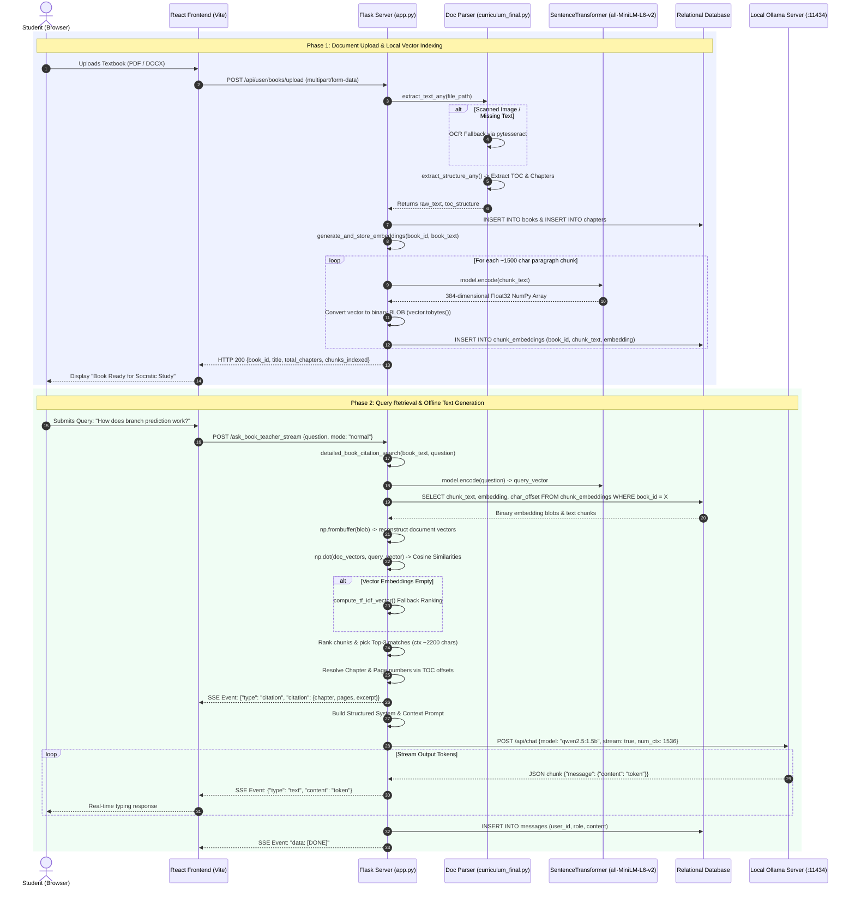
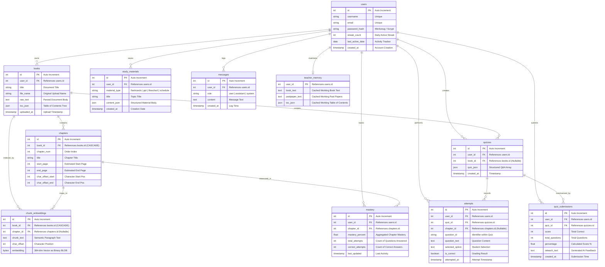
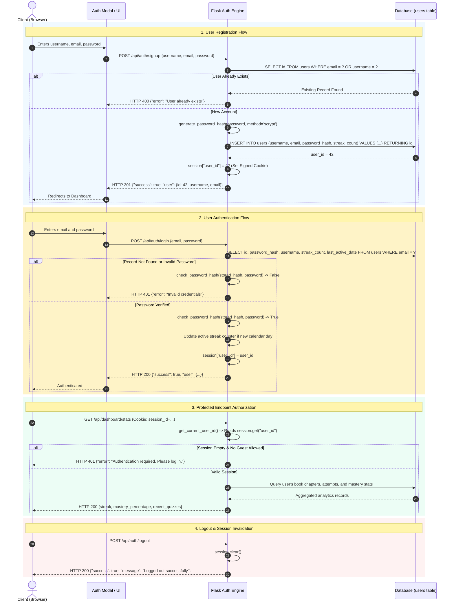

# RoboLearn System Architecture & Technical Design

This document provides a comprehensive, in-depth architectural blueprint of the **RoboLearn AI Tutoring Suite**. It covers the end-to-end system architecture, the local-first Retrieval-Augmented Generation (RAG) pipeline, complete database schemas, session-based authentication workflows, and the local deployment model.

---

## 1. Layered System Overview

The following diagram illustrates the five distinct architectural layers of RoboLearn and the directional data flow between them.

```mermaid
flowchart TB
    %% -------------------------------------------------------------
    %% CLIENT LAYER
    %% -------------------------------------------------------------
    subgraph ClientLayer ["1. Client Layer (React 19 + Vite SPA @ localhost:3000)"]
        direction TB
        UI_Nav["Navbar & Navigation"]
        UI_AuthModal["Auth Modal (Login / Signup / Guest)"]
        UI_Dashboard["Dashboard View (Mastery, Streaks, Analytics)"]
        UI_AiTeacher["AI Teacher Chat (Dual Reference & Socratic Mode)"]
        UI_BookTeacher["Book Teacher & Document Workspace"]
        UI_QuizStudio["Quiz Studio & Reteach Interface"]
        UI_Flashcards["3D Flip Flashcard Generator"]
        UI_Diagrams["Mermaid Flowchart Visualizer"]
        UI_Curriculum["Curriculum & Study Planner"]
        UI_PptExport["PowerPoint Slide Presentation Builder"]
    end

    %% -------------------------------------------------------------
    %% API ROUTING LAYER
    %% -------------------------------------------------------------
    subgraph APILayer ["2. API & Routing Layer (Flask app.py @ localhost:5000)"]
        direction TB
        subgraph Routes_Auth ["Authentication & Session Routes"]
            EP_Signup["POST /api/auth/signup"]
            EP_Login["POST /api/auth/login"]
            EP_Logout["POST /api/auth/logout"]
            EP_Me["GET /api/auth/me"]
            EP_GoogleAuth["POST /api/auth/google"]
        end

        subgraph Routes_Docs ["Document & Book Management Routes"]
            EP_UploadBook["POST /api/user/books/upload"]
            EP_GetBooks["GET /api/user/books"]
            EP_SetActiveBook["POST /api/user/books/active"]
            EP_DeleteBook["DELETE /api/user/books/<id>"]
            EP_TrainTeacher["POST /train_teacher"]
        end

        subgraph Routes_Chat ["AI Reasoning & Streaming Routes"]
            EP_AiChat["POST /ai_chat"]
            EP_AiChatStream["POST /ai_chat_stream (SSE)"]
            EP_BookStream["POST /ask_book_teacher_stream (SSE)"]
            EP_Socratic["POST /socratic_hint"]
            EP_TeachTopic["POST /teach_topic"]
        end

        subgraph Routes_Assessment ["Assessment & Analytics Routes"]
            EP_GenQuiz["POST /generate_quiz"]
            EP_SubmitQuiz["POST /submit_quiz"]
            EP_SaveAttempt["POST /api/quiz/save-attempt"]
            EP_Stats["GET /api/dashboard/stats"]
            EP_Flashcards["POST /generate_flashcards"]
        end

        subgraph Routes_Export ["Synthesis & Generation Routes"]
            EP_Curriculum["POST /generate_curriculum"]
            EP_Flowchart["POST /generate_flowchart"]
            EP_PptSlides["POST /generate_ppt_slides"]
            EP_PptExport["POST /export_ppt"]
            EP_Download["GET /download/<filename>"]
        end
    end

    %% -------------------------------------------------------------
    %% PROCESSING & RAG LAYER
    %% -------------------------------------------------------------
    subgraph ProcessingLayer ["3. Ingestion & RAG Pipeline Layer"]
        direction TB
        FN_ExtractText["extract_text_any()\n(PyMuPDF / python-docx)"]
        FN_OCR["OCR Fallback\n(pytesseract)"]
        FN_Structure["extract_structure_any()\n(Regex TOC & Chapter Hierarchy)"]
        FN_Chunking["Semantic Paragraph Chunking\n(~1500 chars / window)"]
        FN_RAG["semantic_rag_retrieval()\n(Dense Vector Search)"]
        FN_TFIDF["compute_tf_idf_vector()\n(TF-IDF Lexical Fallback)"]
        FN_Citation["detailed_book_citation_search()\n(Page & Chapter Mapping)"]
        FN_CurriculumGen["generate_curriculum_custom()\n(Calendar & Holiday Engine)"]
    end

    %% -------------------------------------------------------------
    %% AI & INFERENCE LAYER
    %% -------------------------------------------------------------
    subgraph AILayer ["4. Local AI & Inference Layer (Offline)"]
        direction TB
        LocalEmbed["SentenceTransformer\n('all-MiniLM-L6-v2' / 384-dim PyTorch)"]
        NumPyCosine["NumPy Vector Math\n(np.dot / Cosine Similarity Ranking)"]
        OllamaCaller["call_ollama() / stream_ollama()\n(backend/config.py)"]
        OllamaServer["Ollama Daemon (localhost:11434)\nModel: qwen2.5:1.5b (1536 ctx)"]
        ResponseCache["In-Memory LRU Cache\n(ResponseCache w/ SHA-256 Keys)"]
    end

    %% -------------------------------------------------------------
    %% STORAGE LAYER
    %% -------------------------------------------------------------
    subgraph StorageLayer ["5. Relational & Vector Storage Layer (db.py)"]
        direction TB
        TBL_Users[("users\n(id, email, password_hash, streak)")]
        TBL_Books[("books\n(id, user_id, title, raw_text, toc_json)")]
        TBL_Chapters[("chapters\n(id, book_id, title, page_start, page_end)")]
        TBL_Embeddings[("chunk_embeddings\n(id, book_id, chapter_id, chunk_text, embedding BYTEA)")]
        TBL_Quizzes[("quizzes\n(id, user_id, book_id, quiz_json)")]
        TBL_Attempts[("attempts\n(id, user_id, quiz_id, question_id, is_correct)")]
        TBL_Submissions[("quiz_submissions\n(id, user_id, quiz_id, score, total)")]
        TBL_Mastery[("mastery\n(id, user_id, chapter_id, mastery_percent)")]
        TBL_StudyMats[("study_materials\n(id, user_id, type, title, content)")]
        TBL_Messages[("messages\n(id, user_id, role, content, created_at)")]
        TBL_Memory[("teacher_memory\n(user_id, book_text, past_text, toc_json)")]
    end

    %% Client -> API Routing
    ClientLayer -->|HTTP JSON / REST| APILayer
    ClientLayer -->|EventSource SSE Stream| EP_AiChatStream
    ClientLayer -->|EventSource SSE Stream| EP_BookStream

    %% API -> Processing & RAG
    EP_UploadBook --> FN_ExtractText
    FN_ExtractText -.->|Scanned Image Fallback| FN_OCR
    FN_ExtractText --> FN_Structure
    FN_ExtractText --> FN_Chunking
    FN_Chunking --> LocalEmbed
    LocalEmbed -->|384-dim Float32 -> Bytes| TBL_Embeddings
    FN_Structure --> TBL_Chapters
    EP_UploadBook --> TBL_Books

    %% Chat & RAG Flow
    EP_BookStream --> FN_Citation
    FN_Citation --> FN_RAG
    FN_RAG -->|Fetch BYTEA Blobs| TBL_Embeddings
    TBL_Embeddings -->|np.frombuffer| NumPyCosine
    FN_RAG -.->|Zero Embeddings Backup| FN_TFIDF
    FN_RAG -->|Top-k Context Chunks| OllamaCaller
    EP_AiChat --> OllamaCaller
    EP_AiChatStream --> OllamaCaller
    EP_GenQuiz --> OllamaCaller
    EP_Socratic --> OllamaCaller
    EP_Flowchart --> OllamaCaller
    EP_PptSlides --> OllamaCaller

    %% Inference Routing
    OllamaCaller <-->|Check / Set Cache| ResponseCache
    OllamaCaller <-->|HTTP POST /api/chat| OllamaServer

    %% Storage Operations
    EP_Signup --> TBL_Users
    EP_Login --> TBL_Users
    EP_SaveAttempt --> TBL_Attempts
    EP_SaveAttempt --> TBL_Mastery
    EP_SubmitQuiz --> TBL_Submissions
    EP_Stats --> TBL_Mastery
    EP_Stats --> TBL_Attempts
    EP_AiChat --> TBL_Messages
    EP_TeachTopic --> TBL_Memory
```



---

## 2. Retrieval-Augmented Generation (RAG) Sequence

The sequence below illustrates the two phases of RoboLearn's RAG system: **Document Ingestion & Vector Indexing** and **Query Retrieval & Socratic Generation**.



---

## 3. Database Entity-Relationship (ER) Diagram

RoboLearn utilizes a relational schema with foreign-key constraints. Vector embeddings are stored directly as binary blobs (`BYTEA` / `BLOB`) to eliminate external vector database dependencies.



---

## 4. Authentication & Session Lifecycle

RoboLearn uses secure, stateful session cookies (`session["user_id"]`) with cryptographic password verification. Guest sessions are supported via isolated, ephemeral identifiers.



---

## 5. Local-First Runtime & Deployment Topology

RoboLearn is completely self-contained. All reasoning, embeddings, vector indexing, and relational queries execute entirely on the local machine with **zero cloud dependencies** for core learning features.

```mermaid
flowchart LR
    subgraph HostMachine ["Host Machine (Localhost)"]
        direction TB

        subgraph ClientSandbox ["Browser Environment"]
            WebBrowser["Modern Web Browser\n(Chrome / Firefox / Edge)"]
        end

        subgraph ViteApp ["Frontend Service (:3000)"]
            ViteServer["Vite Dev / Preview Server"]
            StaticAssets["React SPA Bundle\n(HTML, CSS, JSX)"]
            ViteServer --- StaticAssets
        end

        subgraph FlaskApp ["Backend Service (:5000)"]
            WSGI["Flask WSGI Engine (app.py)"]
            PyTorch["SentenceTransformer\n(all-MiniLM-L6-v2)"]
            VectorEngine["NumPy Vector Math\n(Cosine Similarity / Dot Product)"]
            WSGI --- PyTorch
            WSGI --- VectorEngine
        end

        subgraph StorageService ["Storage Layer"]
            RelationalDB[("SQLite / PostgreSQL\nRelational DB & BYTEA Vectors")]
        end

        subgraph OllamaEngine ["Local AI Daemon (:11434)"]
            OllamaCore["Ollama Service Engine"]
            QwenModel["qwen2.5:1.5b Weights\n(GGUF Local Weights)"]
            OllamaCore --- QwenModel
        end

        %% Internal Machine Connections
        WebBrowser <-->|HTTP / WebSocket / SSE| ViteServer
        ViteServer <-->|Proxy Forwarding: /api/*| WSGI
        WSGI <-->|Local IPC / SQL Queries| RelationalDB
        WSGI <-->|Loopback HTTP POST /api/chat| OllamaCore
    end

    subgraph Internet ["External Internet (Optional / Isolated)"]
        TavilyAPI["Tavily Web Search API\n(Only for live web facts)"]
    end

    WSGI -.->|Optional Grounding (User Enabled)| TavilyAPI

    %% Styling & Annotations
    classDef offline fill:#ecfdf5,stroke:#059669,stroke-width:2px,color:#065f46;
    classDef optional fill:#fef3c7,stroke:#d97706,stroke-width:1px,stroke-dasharray: 5 5,color:#92400e;
    class HostMachine,ViteApp,FlaskApp,StorageService,OllamaEngine offline;
    class Internet,TavilyAPI optional;
```
