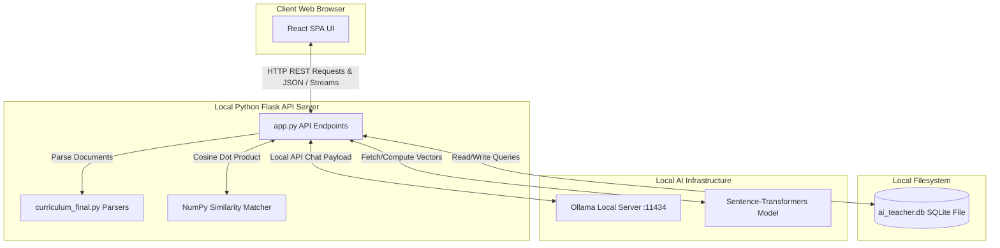

# RoboLearn Technical Overview & Architecture Guide

Welcome to the **RoboLearn Technical Overview**. This document provides an easy-to-understand explanation of the project's technology stack, system architecture, database structure, Retrieval-Augmented Generation (RAG) pipeline, and core codebase components. It is written to help anyone—including educators and project reviewers—understand how RoboLearn works under the hood without needing to read the raw code.

---

## 1. Technology Stack Overview

RoboLearn is built with a modern, fast, and completely local architecture. Every component runs locally on your machine, ensuring data privacy and zero dependence on external API keys or paid services.

### Frontend
* **React (Vite + JavaScript)**: Used to build a responsive, interactive user interface. It handles user interactions (chatting with the tutor, taking quizzes, viewing the dashboard) and provides smooth micro-animations.
* **Vanilla CSS**: Used for rich aesthetics, sleek dark-mode styles, card-based layouts, and responsive design, giving a premium educational feel.

### Backend
* **Python (Flask)**: The lightweight web framework serving as the REST API backend. It receives requests from the React frontend, manages user sessions, queries the database, processes uploaded documents, and interfaces with the local AI.
* **python-pptx & python-docx / openpyxl**: Python libraries used to dynamically generate and export PowerPoint presentations, structured Word reports, and highlighted Excel curriculum spreadsheets.
* **Pillow (PIL)**: Used to create dynamic graphic slide banners and image placeholders for presentation exports.

### Database
* **SQLite (`ai_teacher.db`)**: A serverless, local database file that stores user credentials, uploaded textbook data, generated quizzes, student performance, and AI chat logs.

### AI & Machine Learning
* **Ollama (Local LLM Server)**: Hosts and runs the AI model (by default, `qwen2.5:1.5b`) locally on your machine for quick text generation, quiz building, and Socratic tutoring.
* **Sentence-Transformers (`all-MiniLM-L6-v2`)**: A lightweight embedding model that runs locally via PyTorch. It converts textbook text paragraphs into dense 384-dimensional mathematical vectors (embeddings) for similarity matching.
* **NumPy**: Used to perform fast vector operations in memory to compute the cosine similarity score between the user's query and the textbook chunks.
* **PyMuPDF (`fitz`) & PyTesseract (OCR)**: Used in the document extraction pipeline. `PyMuPDF` reads clean PDF texts, while `PyTesseract` runs Optical Character Recognition (OCR) to extract Urdu, Arabic, Hindi, and English text from scanned files or images.

---

## 2. System Architecture

The diagram below illustrates how frontend, backend, database, and local AI servers coordinate.



### Communication Flow:
1. **Frontend to Backend**: The React frontend sends HTTP requests (e.g., `POST /api/chat/book/stream` to send a message or `GET /api/dashboard/stats` to retrieve dashboard stats) and receives JSON responses or Server-Sent Event (SSE) streams for real-time text generation.
2. **Backend to Database**: Flask connects to the local `ai_teacher.db` file using `sqlite3` to fetch lessons, update user streaks, store quiz attempts, and write message histories.
3. **Backend to Ollama**: Flask sends HTTP requests to the Ollama server listening locally at `http://localhost:11434/api/chat` with system prompts, user questions, and context.

---

## 3. Database Explanation

RoboLearn utilizes a relational SQLite database schema. Below is an explanation of every table and how they relate:

| Table Name | What It Stores | Key Fields & Relationships |
| :--- | :--- | :--- |
| **`users`** | Student user profiles, usernames, emails, hashed passwords, profile pictures, and active streaks. | `id` (Primary Key). Relates to all user-owned data. |
| **`books`** | Uploaded textbook metadata, filenames, full text, and Table of Contents (TOC). | `id` (Primary Key), `user_id` (Foreign Key referencing `users.id` with cascade deletion). |
| **`chapters`** | Chapters extracted from uploaded books. | `id` (Primary Key), `book_id` (Foreign Key referencing `books.id`), `user_id` (Foreign Key). |
| **`chunk_embeddings`** | Small chunked paragraphs of textbook text along with their binary vector embeddings. | `id` (Primary Key), `book_id` & `chapter_id` (Foreign Keys referencing `books` and `chapters`). Stores `embedding` as a binary `BLOB`. |
| **`quizzes`** | Automatically generated quizzes containing question text, choices, correct answers, and difficulty. | `id` (Primary Key), `user_id` & `book_id` (Foreign Keys). |
| **`attempts`** | Detailed question-by-question responses submitted by students during quizzes (tracks selected vs. correct answers). | `id` (Primary Key), `user_id` & `quiz_id` (Foreign Keys). |
| **`quiz_submissions`** | Summary metrics of completed quizzes (overall score, percentage, and timestamps). | `id` (Primary Key), `user_id`, `quiz_id`, `book_id`, `chapter_id` (Foreign Keys). |
| **`mastery`** | Aggregated student mastery score (0-100%) for individual chapters based on quiz submissions. | `id` (Primary Key), `user_id`, `book_id`, `chapter_id` (Foreign Keys). Unique on `(user_id, chapter_id)`. |
| **`study_materials`**| Extracted study guides, flashcards, or generated outputs saved for student access. | `id` (Primary Key), `user_id`, `book_id` (Foreign Keys). |
| **`messages`** | Historical chat transcript between the student and the AI tutor. | `id` (Primary Key), `user_id` (Foreign Key). |
| **`teacher_memory`** | Legacy table persisting active textbook context session-wide. | `user_id` (Primary Key), matches `users.id`. |

---

## 4. RAG Pipeline: Step-by-Step

Retrieval-Augmented Generation (RAG) is the core mechanism that allows the AI teacher to answer questions using *your specific textbook* instead of making things up (hallucination). Here is the flow from file upload to cited answer:

```
[Upload Book] -> Extraction -> Chunking -> Embedding -> Storage
                                                           |
                                                           v
[Ask Question] -> Retrieval -> Similarity Matching -> LLM Call -> Cited Response
```

### Step 1: Extraction
* **What happens**: The user uploads a file (PDF, DOCX, Image) via the UI.
* **Code involved**: The endpoint `/api/user/books/upload` calls `extract_text_any()` (inside [curriculum_final.py](file:///c:/Users/MC/Desktop/RoboLearn/RoboLearn/curriculum_final.py)), which parses the file using `extract_text_from_pdf()` (incorporating Tesseract OCR if pages are scanned/images) or `extract_text_from_docx()`.

### Step 2: Chunking
* **What happens**: The system splits the raw text into small paragraph windows so that they can be efficiently encoded and searched.
* **Code involved**: `save_book_record()` calls `generate_and_store_embeddings()` (inside [app.py](file:///c:/Users/MC/Desktop/RoboLearn/RoboLearn/app.py)). This functions splits the text by `\n\n` paragraphs and groups them into chunks of approximately 1,500 characters.

### Step 3: Embedding
* **What happens**: The text chunks are translated into a sequence of numbers (vectors) representing their semantic meaning.
* **Code involved**: Inside `generate_and_store_embeddings()`, the global `SentenceTransformer('all-MiniLM-L6-v2')` model encodes the list of text chunks.

### Step 4: Storage
* **What happens**: The text and its corresponding vector are written to the database.
* **Code involved**: The 384-dimensional float vector is converted to binary bytes (`.tobytes()`) and inserted into the `chunk_embeddings` table along with the chunk's text and offset.

### Step 5: Retrieval & Similarity Matching
* **What happens**: When the student asks a question, the system converts the question to a vector and finds the top-3 textbook chunks that have the most similar meaning.
* **Code involved**: The chat endpoint calls `detailed_book_citation_search()`, which triggers `semantic_rag_retrieval()`. This loads database chunk embeddings, encodes the query with the transformer model, and uses NumPy's dot-product (`np.dot`) to calculate cosine similarity scores. (If no embeddings exist, it falls back to a custom TF-IDF keyword calculator using `compute_tf_idf_vector()`).

### Step 6: LLM Call
* **What happens**: The retrieved text chunks are pasted into a prompt template alongside the user's question, instructing the LLM to only answer based on the provided context.
* **Code involved**: The system passes the constructed prompt to `call_ollama()`, which POSTs it to the local Ollama chat API.

### Step 7: Response & Citation
* **What happens**: The AI's answer is streamed to the user alongside metadata showing exactly where the answer came from (Chapter Name, page range, and original quote).
* **Code involved**: `detailed_book_citation_search()` returns the citation metadata (resolved using the Table of Contents or `[Page X]` markers in the text). The frontend parses this and renders a citation card underneath the chat response.

---

## 5. Local LLM Connection

RoboLearn interfaces with the local AI server without transmitting any data over the internet.

* **Connection URL & Port**: Connects directly to `http://localhost:11434/api/chat` (port `11434` is the default port for Ollama).
* **Model**: Default model is `qwen2.5:1.5b` (a fast, lightweight model optimal for running on consumer hardware without a dedicated graphics card).
* **Prompt Construction**:
  The application builds a list of chat message dictionaries:
  ```json
  [
    {"role": "system", "content": "You are a helpful AI Tutor... Use the following textbook context to answer: [Textbook Chunks...]"},
    {"role": "user", "content": "What is memory latency?"}
  ]
  ```
* **Payload Parameters**:
  To ensure fast generations and structured output, the backend configures:
  * `temperature`: `0.2` (Low temperature reduces random creativity, keeping answers factual).
  * `num_predict`: `220` - `700` (Controls the maximum tokens/length of the response).
  * `num_ctx`: `1536` (Limits context window to fit cleanly in local memory).
* **Response Parsing**: The JSON output of Ollama is parsed to extract the string content under the `['message']['content']` path.
* **Privacy Confirmation**: **No external API, third-party cloud service, or API keys are used.** The system runs completely offline.

---

## 6. Code Function Reference

Here is a quick reference guide of the primary functions powering the backend logic:

### [app.py](file:///c:/Users/MC/Desktop/RoboLearn/RoboLearn/backend/app.py)
* `get_db_conn()`: Opens a connection to the SQLite database with foreign keys enabled.
* `init_db()`: Sets up the database tables and indexes; runs schema migrations.
* `save_memory()` / `get_memory()`: Restores/saves the active textbook text for guest or legacy sessions.
* `add_message()` / `get_history()`: Writes and fetches message history logs for the chat UI.
* `call_ollama(messages, max_tokens, temperature)`: Calls the local Ollama API server with chat payloads.
* `perform_web_search(query)`: Performs a DuckDuckGo search if the user asks for real-time web facts.
* `get_embedding_model()`: Caches and returns the local `SentenceTransformer` vector encoder.
* `generate_and_store_embeddings(book_id, book_text, conn)`: Main vector indexing routine that chunks book text, embeds paragraphs, and saves them.
* `expand_query_concepts(query)`: Expands short search queries with synonyms (e.g. "CPU" -> "processor, ALU, register").
* `semantic_rag_retrieval(book_text, query, book_id)`: Searches the vector store for semantic matches (with a TF-IDF backup).
* `detailed_book_citation_search(...)`: Orchestrates vector retrieval, page-number detection, and TOC-chapter lookup.
* `upload_user_book()`: Endpoint `/api/user/books/upload` to receive files, extract text, and index chapters.
* `get_dashboard_stats()`: Endpoint `/api/dashboard/stats` to compute student learning progress, streaks, and mastery metrics.
* `save_quiz_attempt()`: Endpoint `/api/quiz/save-attempt` to persist quiz summaries, log per-question attempts, update chapter mastery, and increment user learning streaks in the database.
* `submit_quiz()`: Endpoint `/submit_quiz` to grade MCQs/short-answers (using the LLM for grading when necessary) and generate personalized AI "reteach" feedback for scores below 70%.
* `generate_flashcards()`: Endpoint `/api/generate_flashcards` to produce AI-generated review cards from textbook text.
* `generate_quiz()`: Endpoint `/api/generate_quiz` to create multiple-choice, true/false, or short-answer questions.
* `evaluate_short_answer_with_llm(...)`: Helper to grade free-text student answers via local LLM.
* `generate_curriculum()`: Endpoint `/api/generate_curriculum` to run custom timeline schedulers.
* `build_pptx_presentation(...)`: Assembles a customized, animated PowerPoint presentation using template parameters.
* `generate_flowchart()`: Endpoint `/api/generate_flowchart` that prompts LLM to output clean Mermaid.js flowcharts.
* `socratic_hint()`: Endpoint `/socratic_hint` that evaluates student answers socratically and responds with guiding hints.

### [curriculum_final.py](file:///c:/Users/MC/Desktop/RoboLearn/RoboLearn/backend/curriculum_final.py)
* `normalize_digits(text)`: Translates Eastern numerals (Arabic, Persian, Hindi) to standard Western digits.
* `clean_lines(text)`: Trims whitespace and cleans up raw OCR text layout.
* `extract_text_any(path, ocr_langs)`: Dispatches the uploaded document to PyMuPDF, PyTesseract, or python-docx.
* `extract_text_from_pdf(path, ocr_langs)`: Reads standard PDFs or falls back to OCR if page content is scanned images.
* `extract_text_from_docx(path)`: Extracts raw paragraph lines from Word files.
* `extract_text_from_image(path, ocr_langs)`: Extracts language-specific text from image formats using PyTesseract.
* `extract_structure_any(text)`: Employs heuristic keyword parsing to extract a hierarchical Table of Contents.
* `get_eid_holidays(year)`: Identifies variable Eid Islamic holidays for school timeline calendars using `hijridate`.
* `is_holiday(date)`: Checks if a date falls on a weekend or public/vacation holiday.
* `generate_curriculum_9_months(...)`: Schedules curriculum chapters across a standard 9-month timeline, skipping holidays.
* `generate_curriculum_custom(...)`: Generates schedules for variable school lengths (weeks/months).
* `export_to_word(df, filename)`: Writes curriculum schedules to highly styled Word tables.
* `highlight_excel(excel_path, df)`: Formats and styles Excel sheets with colors, headers, and clean border styles.

---

## 7. Authentication Flow

RoboLearn uses secure, stateful session-based cookies to authorize routes and protect student data.

```
[Sign Up] ---> [Login] ---> [Flask Session Cookie Set] ---> [Access Protected API Routes]
                                                                        |
                                                                        v
[Sign Out] <--------------------------------------------- [Clears Session Cookie]
```

### Sign Up (`auth_signup`):
1. The user inputs their `username`, `email`, and `password`.
2. The backend hashes the password using the scrypt algorithm via `generate_password_hash()`.
3. The hashed password and email are inserted into the `users` table.

### Login (`auth_login`):
1. The user inputs their `email` and `password`.
2. The backend retrieves the corresponding row from the `users` table and compares hashes using `check_password_hash()`.
3. If they match, Flask sets session attributes:
   ```python
   session["user_id"] = user_record["id"]
   session["username"] = user_record["username"]
   session["email"] = user_record["email"]
   ```
4. A secure cookie is sent to the client browser.

### Route Protection:
* Protected API endpoints verify the active user session on every request:
  ```python
  user_id = session.get("user_id")
  if not user_id:
      return jsonify({"error": "Unauthorized session"}), 401
  ```
* If the user logs out (`auth_logout`), the session is cleared (`session.clear()`), destroying the cookie and revoking access to protected routes.
